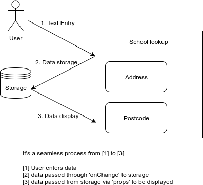
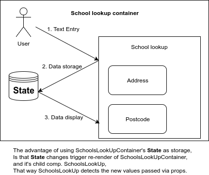

# SchoolsLookUp
> A component responsible for handling Edco lookup

### Why don't we save data directly inside SchoolsLookUp ?
* Data at that case is selected school or manually entered one
* We are already saving school details outside the component, so it felt redundant to save the details inside the component at the same time.

### Why do we have multiple methods dedicated to rendering ?
* We have a lot of fields that are displayed at different cases which led to a big render method, but redundancy can be spotted
* To minimize redundancy, we can move any repetitive snippet into a method and just reuse it saving space and enhancing readability

### Why do we have a lot of props ?
* We need to avoid static attributes and provide some flexibility to the container
* For instance, We may need to set input id and name, so it's better to have that as a prop
* Sometimes an optional prop with a default value is a better option, so that whenever it is not needed, we don't have to pass it.

### How are fields validated ?
* Validation logic itself does not exist inside component, as that's not school lookup responsibility
* A validation trigger is inserted into the component to be executed whenever a change occurs
* Error messages are passed to the component to be displayed

### Why do we need SchoolsLookUpContainer ?
* SchoolsLookUp needed to be re-rendered in order to notice new values passed via props
* Storybook loaded the component once, and ignores whatever changes occur later
* State can re-render SchoolsLookUp, when it changes [State and lifecycle](https://reactjs.org/docs/state-and-lifecycle.html)